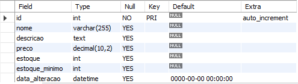
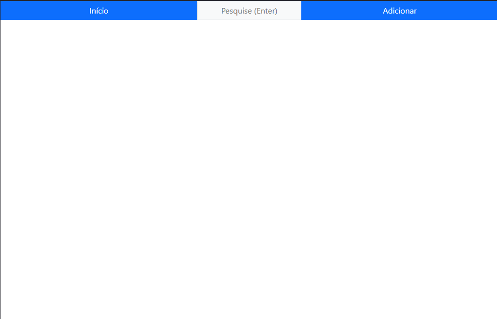
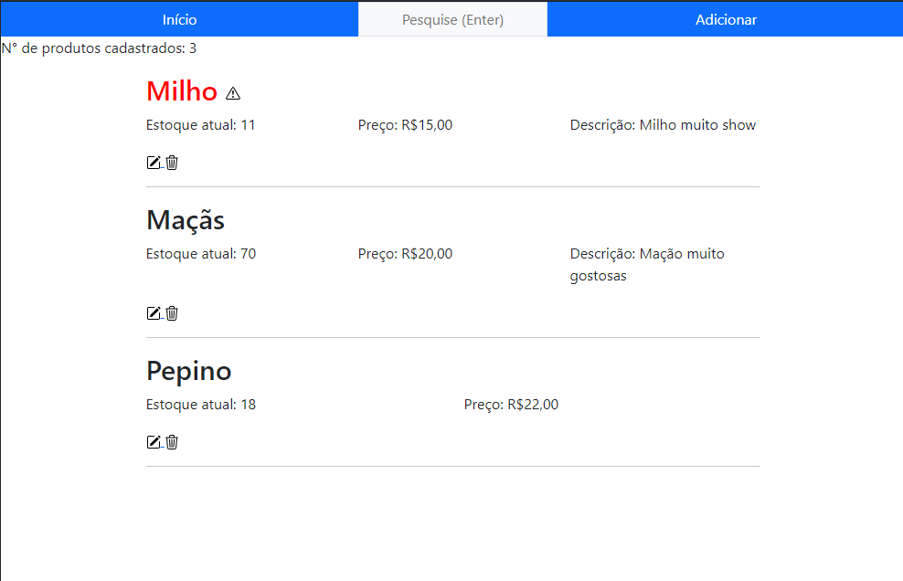
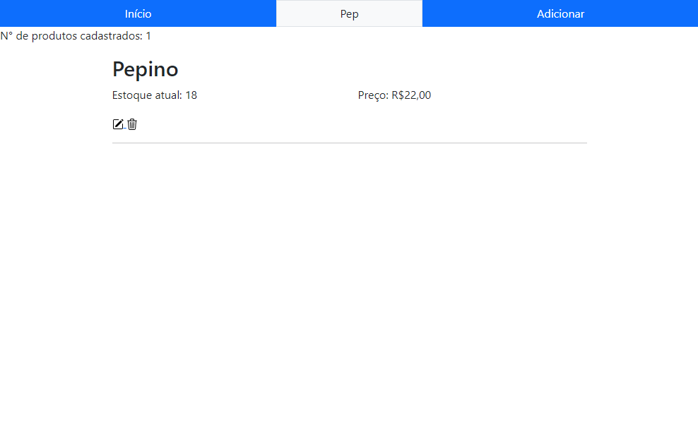
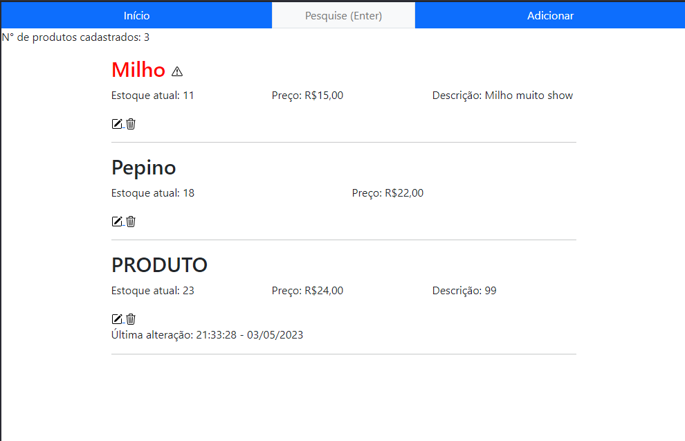
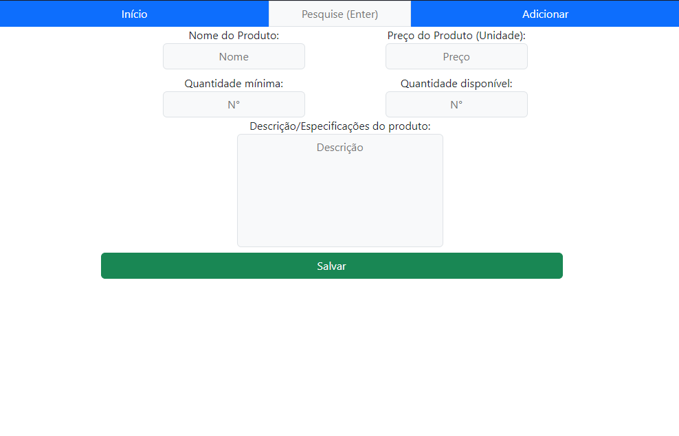
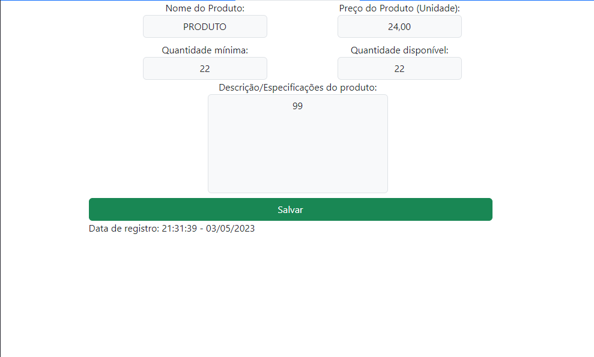

# Gestor
<h1> O que é esse projeto ? </h1>

Primeiro projeto que subo de fato aqui na plataforma, os demais eram todos remotos e nada esquematizados.

 Projeto de gestão de estoque usando PHP puro.

Treinando um pouco da linguagem e versionamento. 
Usando Bootstrap (primeira vez) para agilizar um pouco a questão estilística já que o foco não é o CSS.

Estou tirando as coisas da cabeça pra fazer isso daqui, não peguei inspiração de nenhum lugar, então talvez pudesse implementar algumas partes de maneira mais eficiente. Estou avaliando isso conforme avanço o projeto e vou reavaliando o que já foi feito. Qualquer sugestão ou comentário seria de grande ajuda.

<h1>O projeto</h1>

Bom, pensei em fazer este sistema de gestão de estoque, pois vi que poderia aplicar vários conceitos.

O banco de dados foi esquematizado da seguinte maneira:

 
<h2>Tela princípal:</h2>

É possível filtra produtos pelo nome (número de itens filtrados no canto superior esquerdo) , ir a tela de adição e de edição. Adicionei uma estilização para os produtos com estoque menor ou igual ao estoque mínimo. Além disso, fica registrada a data e a hora da última alteração realizada no produto.

 

 
<h2>Tela Adição/Edição:</h2>

Aqui montei quatro campos obrigatórios, que são os de nome, preço, quantidade mínima e o estoque atual. Apenas o campo de descrição é opicional. Além disso, é possível observar a data que o produto foi cadastrado abaixo do botão "salvar".

<h2>Conclusão e futuras adições:</h2>

Bom, essa é uma base do que gostaria de fazer com esse projeto, pretendo ir adicionando mais coisas, mas essa não é minha prioridade no momento. Quero subir mais projetos relacionados a outras linguagens/frameworks.

Algumas ideias que podem ser adicionadas/implementadas no futuro:

<ul>
<li>Sistema de login com permisões para diferentes tipos de usuários.</li>
<li>Categorias para os produtos.</li>
<li>Filtragens com base em outros parâmetros.</li>
<li>Máscaras para os inputs.</li>
<li>Contador de caracteres para o campo de descrição.</li>
<li>Tornar a filtragem dinâmica, ao invés de fazer uma query e ter que recarregar a página.</li>
<li>Colocar um limite de produtos por página. </li>
<li>Permitir o usuário escolher o mínimo de estoque em %.</li>
<li>Código para cada produto.</li>
<li>Histórico de alteração de cada produto com hora e usuário apontado.</li>
<li>Gráficos indicando a oscilação de um determinado produto/categoria durante uma faixa de tempo especificada.</li>
</ul>

Por enquanto é isso, algumas coisinhas ai são fáceis e outras são mais elaboradas, mas como o projeto já tem seu alicerce, vou deixar pra fazer conforme o tempo.

